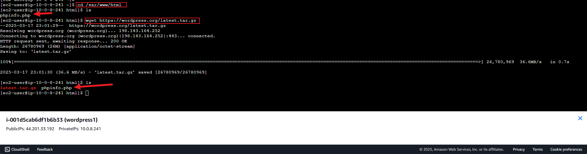
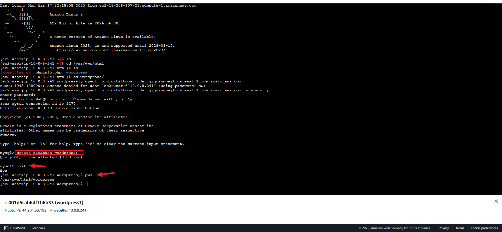
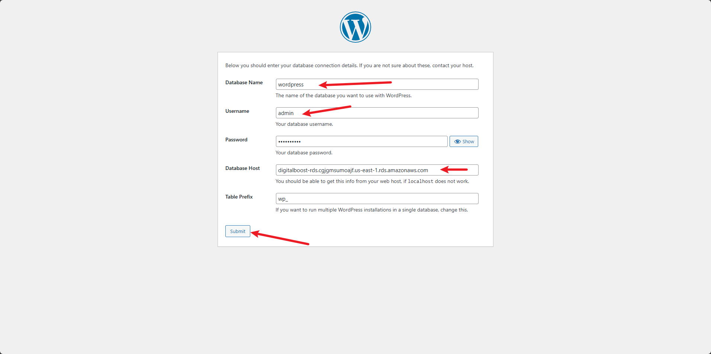
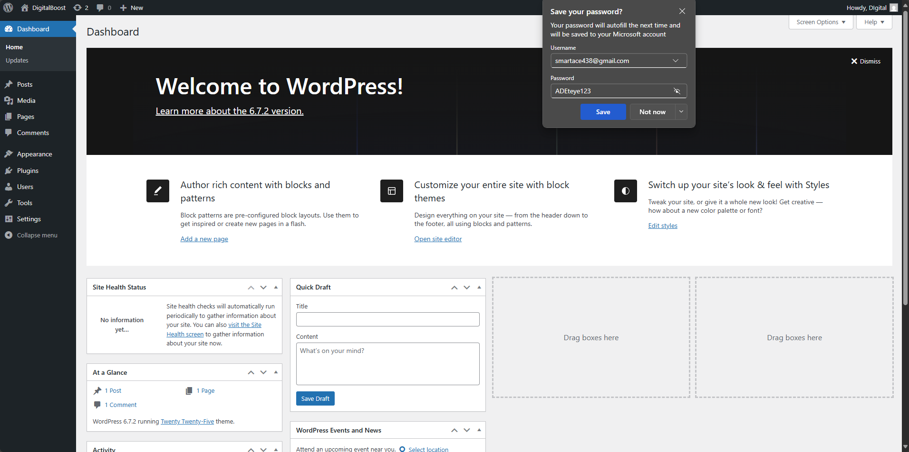

# WordPress-site-on-AWS
The aim of this project is to design and implement a WordPress solution using various AWS services, such as Networking, compute, object storage and Database
DigitalBoost wants to enhance its online presence by creating a high-performance WordPress-based website for their clients,which is why it needs Creating a scalable, secure and cost effective solution that can handle increasing traffic and seamlessly integrate with existing infrastructure

# VPC
The first step is creating a VPC  which must have this key components:
   * a proper definition of the IP address range on the VPC
   * Public and Private subnet in two availability zone
   * correct configuration of route tables for each subnet

as shown below:

# Subnet
 After creating the VPC, i created the private and public subnets and also allocated each an IPv4 CIDR range 
  * public-subnet1:  10.0.8.0/24
  * public-subnet2:  10.0.2.0/24
  * private-subnet1: 10.0.240.0/20
  * private-subnet2: 10.0.16.0/20
  as seen below:

#  Internet Gateway
creating an internet gateway and attaching it to the VPC in other to give it access to the internet
* NOTE:The internet gateway is used to allow communication between the VPC and the Internet:

# Route Table
creating the route table and configuring it to route traffic to the internet Gateway which allows connectivity to the internet, only the subnet named "public-subnet1" can access the internet because only it was associated with the route table:

after creating the route table (public-routetable) i associate it with my public-subnet1 which gives the route traffic is to follow from the internet gateway to the internet:

creating another routable (private-routetable) to associate both private subnet together:

# Nat Gateway
The Nat Gateway allows the instances in the private App subnets and private Data subnets,The Private Route Table is associated with the private subnets and routes:

## AWS MySQL RDS setup
# Relational Database Service (RDS)

Creating an Amazon RDS "digitalboost-rds" instance with MYSQL engine afterwhich i configure the security group for RDS instance and connect the wordpress to the RDS instance:
* Note: wordpress is used to create and manage a website 

RDS instance creation:

Security Group Configuration:
* Note: make sure the security Group is configured properly i.e adding an inbound rule for MySQL/Aurora on port 3306 which allows traffic from the 0.0.0.0/0 CIDR range: 

# AUTO SCALING GROUP (ASG):
ASG helps with scalability, availability, and cost optimization by automatically adding or removing instances based on demand The first step is creating an "ASG", we would need to create a "launch template" during the process following the steps shown below by defiing the scaling policies a d configuring the instances:

Creating an ASG to automatically adjust the number of instances based on traffic load following the steps below:
* create an auto scaling group

* define the scaling metrics 

### configuring the LAMP Server so wordpress can worko on it

Apache httpd serves files that are kept in a directory called the Apache document root. The Amazon Linux Apache document root is /var/www/html, which by default is owned by root.

To allow the ec2-user account to manipulate files in this directory, i modified the ownership and permissions of the directory by adding ec2-user to the apache group, to give the apache group ownership of the /var/www directory and assign write permissions to the group afterwhich i logged back into the ec2 instance and verified with the command "group" as shown below:

i change the group ownership of /var/www and its contents to the apache group w ith the command "sudo chown -R ec2-user:apache /var/www"

i added group write permissions and to set the group ID on future subdirectories, change the directory permissions of /var/www and its subdirectories "sudo chmod 2775 /var/www && find /var/www -type d -exec sudo chmod 2775 {} \;".

i finally added the group write permissions, recursively change the file permissions of /var/www and its subdirectories "find /var/www -type f -exec sudo chmod 0664 {} \;"

Now,my ec2-user (and any future members of the apache group) can add, delete, and edit files in the Apache document root, enabling you to add content, such as a static website or a PHP application.

Testing the LAMPD server using the public ip address
first we need to use the command "echo "<?php phpinfo(); ?>" > /var/www/html/phpinfo.php" to create a PHP file in the Apache document root afterwhich we type the public ip address with /phpinfo.php (http://44.201.33.192/phpinfo.php)
as we can see from the output below our configuration was successful:

 
 The next step is to install wordpress

 ## WORDPRESS configuration
First we access the var directory "var/www/html" and use the command "wget https://wordpress.org/latest.tar.gz" to install the wordpress on the instance:

the command "tar -xvf latest.tar.gz " is used to extract the wordpress file that was just downloaded:

WordPress-RDS connection:

connecting to the RDS database which is done by first moving in to the wordpress directory on our instance and using the command "mysql -h" and our RDS Endpoint (digitalboost-rds.cgjgmsumoajf.us-east-1.rds.amazonaws.com) to connect as shown below:

# creating a database named "wordpress" inside the RDS afterwhich it is connected to our RDS website using the public ip address and the index.php on our browser

type "http://44.201.33.192/wordpress/index.php" on a web browser

 since our connection for the RDS and wordpress was successful th enext astep is to create a folder " wp-config.php file" inside wordpress and copy the content of the configuration file into it:
 using the command "vim wp-config.php file.php" to create a file and copy and paste the content into it afterwhich we can run the installation:
 
 
 
 our wordpress has been successfully installed on the RDS server and we can access the dashboard:
 
 
